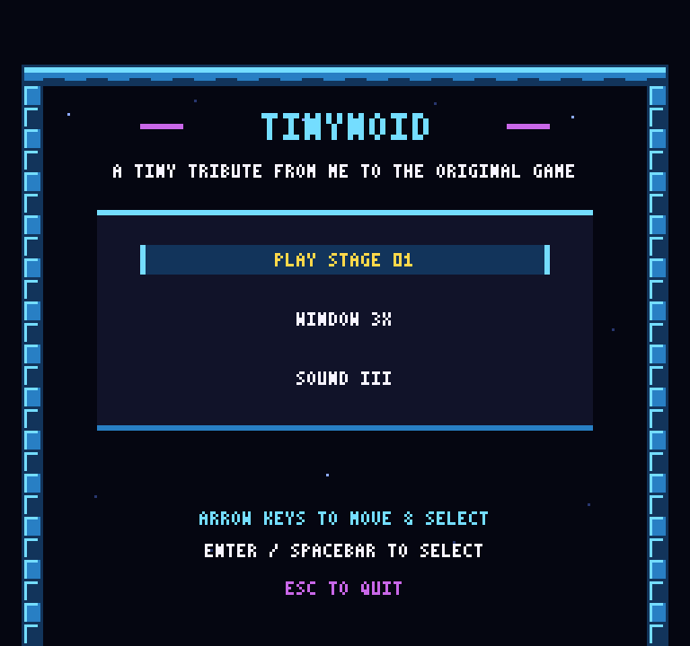
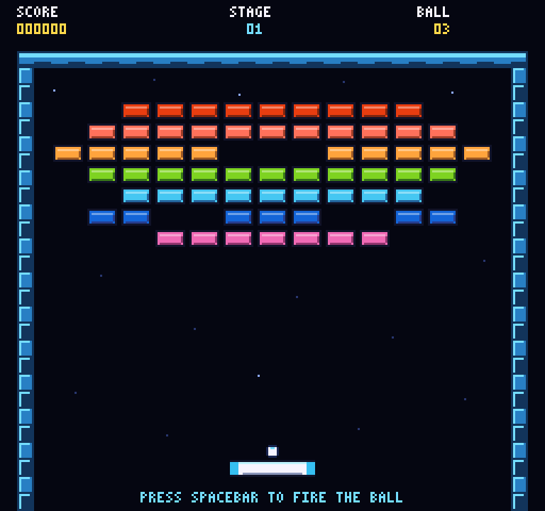
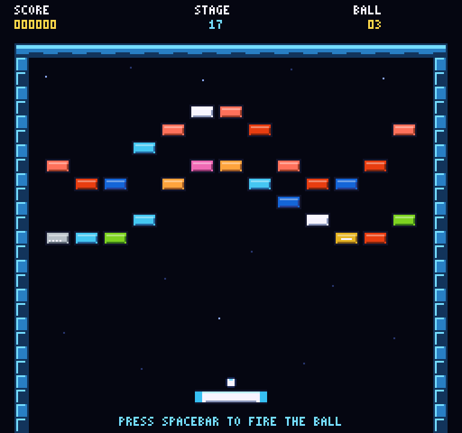

# TINYNOID

🎮 A tiny tribute to the classic NES Arkanoid, built in Godot with a twist:
procedurally generated graphics and music.

## Download latest build

[▶ Play TINYNOID in your browser](https://adrianmg.github.io/tinynoid/)

| Platform | Download |
| --- | --- |
| Web | [tinynoid-web.zip](https://github.com/adrianmg/tinynoid/releases/latest/download/tinynoid-web.zip) |
| Windows x86_64 | [tinynoid-windows-x86_64.zip](https://github.com/adrianmg/tinynoid/releases/latest/download/tinynoid-windows-x86_64.zip) |
| Linux x86_64 | [tinynoid-linux-x86_64.tar.gz](https://github.com/adrianmg/tinynoid/releases/latest/download/tinynoid-linux-x86_64.tar.gz) |
| macOS universal | [tinynoid-macos-universal.zip](https://github.com/adrianmg/tinynoid/releases/latest/download/tinynoid-macos-universal.zip) |
| Checksums | [SHA256SUMS](https://github.com/adrianmg/tinynoid/releases/latest/download/SHA256SUMS) |

## Screenshots

| Main menu | Stage 1 — Rainbow Gate | Stage 17 — Waveform II |
| --- | --- | --- |
|  |  |  |

## Play

Open [`godot/project.godot`](godot/project.godot) in Godot 4.7.2 and run the
main scene.

### Controls

- **Move:** Arrow keys, A/D, mouse, or controller stick
- **Launch / Select:** Spacebar, Enter, mouse button, or controller face button
- **Menus / High Scores:** Arrow keys, mouse, or controller
- **Restart stage:** R
- **Return to menu:** Escape
- **Window size:** F2 for 2×, F3 for 3×
- **Fullscreen:** F11 or Alt+Enter

## Highlights

- 33 original stages
- Eight capsules: Expand, Slow, Disruption, Catch, Laser, Break, Player, and Thru
- Protected random drops reward the opening and prevent long dry streaks
- Global Top 100 scores with offline local history
- Post-game X/Twitter handles and palette-pixelated profile avatars
- Shareable Game Over and Campaign Clear score cards
- Standard, multi-hit Silver, and indestructible Gold bricks
- Pixel-perfect 256×240 rendering with integer scaling
- Distinct procedurally generated music for the menu and every stage
- Generated sound effects, visuals, animations, and level layouts

## Development

Run the headless test suite:

```sh
godot --headless --path godot res://tests/test_runner.tscn
```

The legacy Unity project remains in the repository as migration history. The
Godot game uses original layouts and generated presentation assets.

## Credits

[X/Twitter avatars provided by Unavatar](https://unavatar.io).
